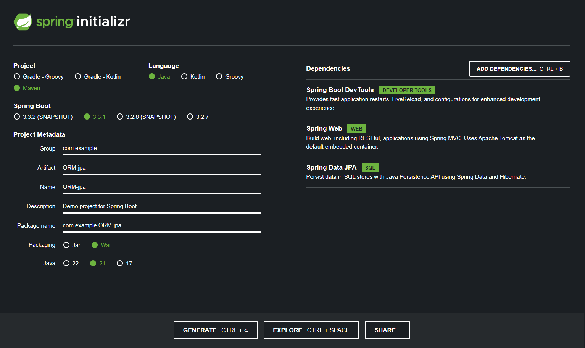

Iniciando um projeto com o JPA (ORM)



<!-- ------------------------------------------------------------ -->

Criando uma entity com antes de utilizar o ORM

```java
package com.example.ORM_jpa;

import jakarta.persistence.Column;
import jakarta.persistence.Entity;
import jakarta.persistence.GeneratedValue;
import jakarta.persistence.GenerationType;
import jakarta.persistence.Id;

@Entity(name = "usuarios")
public class Usuario {

    @Id
    @GeneratedValue(strategy = GenerationType.AUTO)
    private Long id;

    // @Column  <<< Desta maneira ela ja começa nula por padrao. Significa que ela nao é obrigatoria
    @Column(nullable = false) // Assim define como obrigatoria
    private String nome;

}

```
