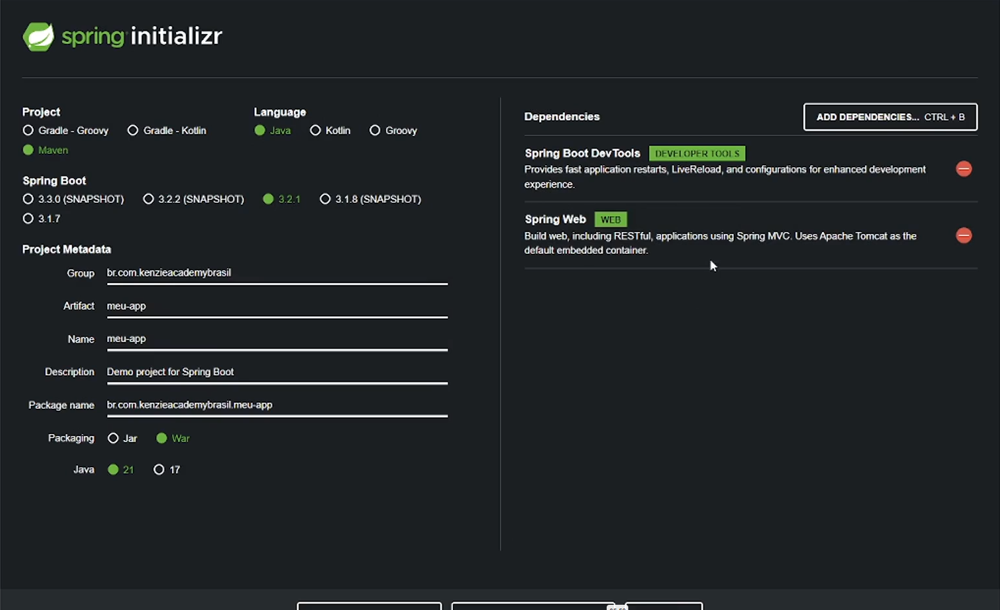

### Link para o site de inicializador: https://start.spring.io/



Voce precisa gerar o arquivo, extrair e colocar dentro do vscode.

Para startar o projeto pelo terminal

```bash
    # Primeiro de um "ls" no terminal pra ver se voce ta na pasta certa.
    .mvnw spring-boot:run
```

<!-- ------------------------------------------------------------ -->

<!-- Instalaçao de Dependencias -->

Va até o site de dependencias do mvn: https://mvnrepository.com

```xml
<!-- https://mvnrepository.com/artifact/org.projectlombok/lombok -->
<dependency>
    <groupId>org.projectlombok</groupId>
    <artifactId>lombok</artifactId>
    <version>1.18.34</version>
    <scope>provided</scope>
</dependency>
```

E voce deve instalar no arquivo POM.xml. Onde tiver

```xml
	<dependencies>
        <!-- Aqui -->
    </dependencies>
```

<!-- ------------------------------------------------------------ -->

<!-- Criaçao de rotas GET -->

Cria um novo arquivo, exeplo: PrimeiraRotaGet.java e coloca o seguinte:

```java
package com.br.leonhart.meu_app;

import org.springframework.web.bind.annotation.GetMapping;
import org.springframework.web.bind.annotation.RestController;

@RestController
public class PrimeiraRotaGet {
    @GetMapping("/rota_get")
    public String read() {
        return "Minha primeira rota get";
    }
}

// Acessando no Insomniaa: localhost:8080/rota_get
```

<!-- Criação da rota POST -->

Cria um novo arquivo, exeplo: PrimeiraRotaPost.java e coloca o seguinte:

```java
package com.br.leonhart.meu_app;

import org.springframework.web.bind.annotation.PostMapping;
import org.springframework.web.bind.annotation.RequestBody;
import org.springframework.web.bind.annotation.RestController;

@RestController
public class PrimeiraRotaPost {
    @PostMapping("/rota_post")
    public String create(@RequestBody String payload) { // Precisa desse "@RequestBody Tipagem Parametro" para que ele ache o que voce quer mandar
        return payload;
    }
}

// Acessando no Insomniaa: localhost:8080/rota_post
```

<!-- ------------------------------------------------------------ -->

<!-- BE04-15 | 📘 Aula - Annotations -->

Sao tipo etiquetas que fornece informaçoes adcionais dos metodos.

```java
package com.br.leonhart.meu_app;

public class BE04_15_Annotations {
    @Deprecated // Informar codigos obsoletos
    public void metodoAntigo() {

    }

    // @Override // Sobrescrever/Alterar um metodo/classe que ja existe
    // public class metodoJaExisteMasAlterado {

    // }
}
```
